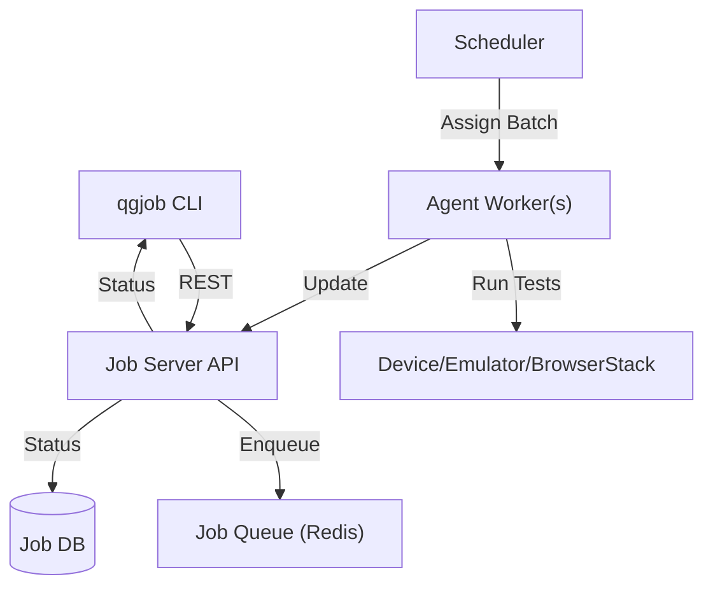

# qgjob

A CLI tool and backend to queue, group, and deploy AppWright test jobs across emulators, devices, and BrowserStack.

## Features
- Submit and track test jobs via CLI
- Jobs grouped by app version and target for efficient batching
- Prioritization and deduplication
- Retry and failure handling
- Scalable, modular backend
- GitHub Actions integration

## Installation

```bash
pip install qgjob
```

## Usage

```bash
qgjob submit --org-id qualgent --app-version-id xyz123 --test tests/onboarding.spec.js --target emulator
qgjob status --job-id abc456
```

## Setup (Local & Docker)

### Local Backend
- Requires Python 3.7+, Redis, and PostgreSQL (or use in-memory for demo)
- Install dependencies: `pip install -r requirements.txt`
- Start backend: `uvicorn job_server.main:app --reload`
- Start agent(s): `python job_server/agent_worker.py --target emulator --app-version-id xyz123`

### Docker Compose
```bash
docker compose up --build --scale agent=3
```

## Architecture



## Grouping & Scheduling
- Jobs are grouped by `app_version_id` and `target`.
- Jobs with the same app version and target are batched to minimize app installs.
- Prioritization: lower `priority` value = higher priority.
- Deduplication: duplicate jobs (same org, app version, test, target) are blocked.
- Retry: failed jobs are retried up to 3 times by default.

## End-to-End Example
1. Start backend and agents (see Docker or local setup above).
2. Submit a job:
   ```bash
   qgjob submit --org-id qualgent --app-version-id xyz123 --test tests/onboarding.spec.js --target emulator
   ```
3. Check status:
   ```bash
   qgjob status --job-id <job_id> --poll
   ```
4. See results in CLI and backend logs.

## GitHub Actions Workflow
See `.github/workflows/appwright-test.yml` for a full CI example:
- Installs backend and CLI
- Submits a test job
- Polls for completion
- Fails build if any test fails

## Sample Output Logs
```
Job submitted! ID: 1234abcd | Status: queued
Job 1234abcd → in_progress
Job 1234abcd → completed
```

## Monitoring
- Health: `GET /healthz`
- Metrics: `GET /metrics`

## License
MIT
