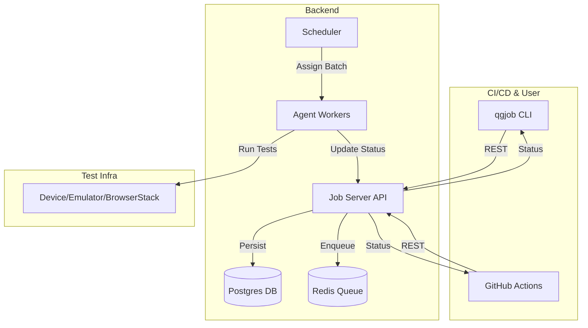

# Backend Coding Challenge

A robust, scalable platform for queuing, grouping, and deploying AppWright test jobs across emulators, devices, and BrowserStack. Includes a CLI, backend orchestrator, and full CI/CD integration.

---

## Features
- **CLI Tool (`qgjob`)**: Submit and track test jobs from the command line
- **Backend Service**: Receives, groups, queues, and schedules jobs efficiently
- **Job Grouping**: Batches jobs by `app_version_id` and `target` to minimize installs
- **Prioritization & Deduplication**: Jobs are prioritized and deduplicated
- **Retry & Failure Handling**: Automatic retries for failed jobs
- **Horizontal Scalability**: Stateless orchestrator, scalable agents
- **Monitoring**: Health and metrics endpoints
- **GitHub Actions Integration**: End-to-end CI/CD, fails on test failure

---

## Architecture



---

## Grouping & Scheduling
- **Grouping**: Jobs are grouped by `app_version_id` and `target` (e.g., all jobs for the same app version and emulator are batched together).
- **Batching**: Batches are assigned to available agents, minimizing app installs and maximizing efficiency.
- **Prioritization**: Jobs are dequeued by priority (lower value = higher priority).
- **Deduplication**: Duplicate jobs (same org, app version, test, target) are blocked.
- **Retry**: Failed jobs are retried up to 3 times by default.

---

## Setup

### Local Development
1. **Install dependencies**:
   ```bash
   pip install -r requirements.txt
   ```
2. **Start backend**:
   ```bash
   uvicorn job_server.main:app --reload
   ```
3. **Start agent(s)**:
   ```bash
   python job_server/agent_worker.py --target emulator --app-version-id all
   ```

### Docker Compose (Recommended for CI)
```bash
docker compose up -d --build
```
- Starts backend, Postgres, Redis, and a generic agent that can pick up any job.

---

## CLI Usage

### Install
```bash
pip install --upgrade qgjob
```

### Submit a Job
```bash
qgjob submit --org-id qualgent --app-version-id xyz123 --test tests/onboarding.spec.js --target emulator --priority 2
```

### Check Job Status
```bash
qgjob status --job-id <job_id>
```

### Machine-Readable Output (for CI)
```bash
qgjob submit ... --json
qgjob status --job-id <job_id> --json
```

---

## GitHub Actions Workflow
- **Fully automated**: Starts all services, submits all test jobs, waits, checks status, and fails if any test fails.
- **No manual steps required**.

Example (see `.github/workflows/appwright-test.yml`):
```yaml
- name: Install qgjob CLI
  run: pip install --upgrade qgjob==1.4.0
- name: Submit all test jobs
  run: |
    OUTPUT=$(qgjob submit ... --json)
    # ...
- name: Wait for jobs to complete
  run: sleep 60
- name: Check final job statuses
  run: |
    qgjob status --job-id=<job_id> --json
    # ...
```

---

## Monitoring
- **Health**: `GET /healthz` returns `{ "status": "ok" }`
- **Metrics**: `GET /metrics` returns job counts by status

---

## Sample Output Logs
```
Job submitted! ID: 1234abcd | Status: queued
Job 1234abcd → in_progress
Job 1234abcd → completed
```

---

## How the System Works
1. **User or CI submits jobs via CLI**
2. **Backend groups jobs by app_version_id and target**
3. **Jobs are queued in Redis and persisted in Postgres**
4. **Agents poll for jobs and execute batches efficiently**
5. **Job status is updated and can be polled or checked via CLI or CI**
6. **Failed jobs are retried up to 3 times**
7. **Monitoring endpoints provide health and metrics**

---

## License
MIT
